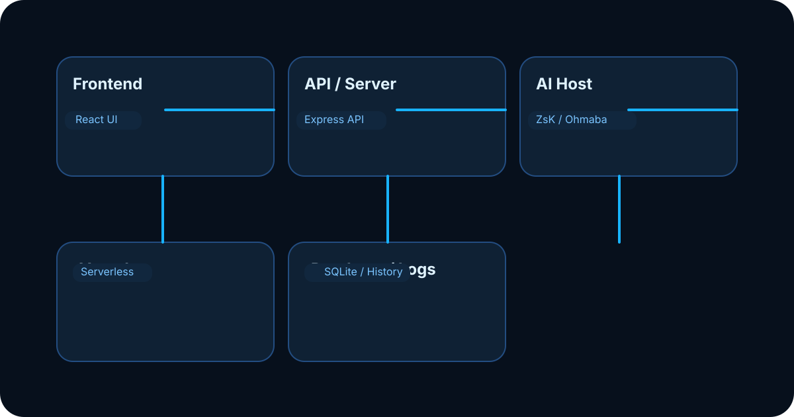

<div align="center">

# ZsK AI Bot



**AI host miễn phí và self-host miễn phí cho thử nghiệm — deploy nhanh lên Vercel và dùng local agent demo `zsk`.**

[](LICENSE)
[](https://react.dev)
[](https://www.typescriptlang.org)
[](https://vitejs.dev)
[](https://vercel.com)

[Demo](#-demo) · [Tính năng](#-tính-năng-nổi-bật) · [Cài đặt](#-cài-đặt-nhanh) · [Deploy Vercel](#-deploy-lên-vercel) · [Cấu trúc](#-cấu-trúc-dự-án)

</div>

---

## 🚀 Tổng quan

ZsK AI Bot là một dự án web React + TypeScript được xây dựng để chạy AI chat host miễn phí và self-host agent. Dự án lý tưởng cho thử nghiệm, demo và deploy nhanh lên Vercel.

Ứng dụng hỗ trợ:

- `zsk`: local free demo agent tích hợp sẵn để dùng ngay, không cần API key.
- `ohmaba`: kết nối với endpoint custom cho self-host hoặc dịch vụ agent ngoài.
- `Vercel`: frontend + serverless API hoạt động cùng nhau với cấu hình đã sẵn sàng.
- `Branding`: dynamic SVG logo cho ZsK AI tại `assets/zsk-ai-logo.svg`.


---

## ✨ Tính năng nổi bật

- ✅ **Local free agent `zsk`**: chạy ngay mà không cần token hoặc endpoint bên ngoài.
- ✅ **Self-host agent**: dùng `OHMABA_URL` để kết nối agent riêng hoặc dịch vụ không mất phí.
- ✅ **Vercel-ready deployment**: `vercel.json` đã cấu hình route và build cho `api/chat`.
- ✅ **React + Vite**: frontend hiện đại với proxy dev cho trải nghiệm mượt mà.
- ✅ **Express API backend**: handle route chat trung tâm, chọn provider theo `model`.
- ✅ **Môi trường linh hoạt**: `DEFAULT_MODEL`, `OHMABA_API_KEY`, `GEMINI_API_KEY`.

---

## 🧠 Kiến trúc nhanh



- `src/` chứa frontend React và backend Express.
- `src/providers/` chứa adapter provider cho AI hosts.
- `src/routes/chat.js` xử lý request chat và chọn provider theo `model`.
- `api/chat.js` là endpoint serverless dành cho Vercel.
- `vercel.json` cấu hình build + route cho deployment.

---

## 🧰 Cài đặt nhanh

### Yêu cầu

- Node.js `>= 18`
- `npm` hoặc `yarn`

### Chạy local

```bash
git clone https://github.com/<your-username>/ZsK-bot.git
cd ZsK-bot
npm install
cp .env.example .env
```

Mở file `.env` và chỉnh cấu hình theo nhu cầu.

```bash
# 1) Chạy backend API
npm run api

# 2) Chạy frontend dev server
npm run dev
```

Hoặc chạy cả frontend và backend cùng lúc bằng `npx`:

```bash
npx concurrently "npm run api" "npm run dev"
```

Nếu muốn chỉ chạy frontend hoặc backend riêng:

```bash
npx vite
npx node src/server/index.js
```

Mở `http://localhost:5173` trong trình duyệt.

> Vite proxy `/api`, `/v1`, `/chat` tới backend API để chat hoạt động mượt mà.

## ☁️ Deploy lên Vercel

### 1. Cài Vercel CLI

```bash
npm install -g vercel
```

### 2. Kiểm tra `vercel.json`

Project đã có `vercel.json`:

- build static frontend từ `package.json`
- build serverless `api/**/*.js`
- routes `/api/*`, `/v1/chat`, `/chat`

### 3. Thiết lập environment variables trên Vercel

- `DEFAULT_MODEL=zsk` hoặc `ohmaba`
- `OHMABA_URL` nếu dùng self-host agent
- `OHMABA_API_KEY` khi cần
- `GEMINI_API_KEY` nếu dùng Gemini

### 4. Deploy

```bash
vercel --prod
```

Hoặc dùng GitHub integration để deploy tự động.

---

## 📦 Scripts hữu ích

| Lệnh | Mô tả |
|---|---|
| `npm run dev` | Chạy frontend dev server |
| `npm run api` | Chạy backend Express API |
| `npm run build` | Build production |
| `npm run preview` | Xem trước bản build |
| `npm run lint` | Kiểm tra lint |

---

## 📁 Cấu trúc dự án

```
ZsK-bot-main/
├── src/
│   ├── components/         # Các UI component (Terminal, Drawer, Modal, Sidebar...)
│   ├── utils/               # Logic xử lý: Watson Engine, Google Auth, Export...
│   ├── types/                # Định nghĩa kiểu dữ liệu TypeScript
│   ├── App.tsx               # Component gốc, quản lý state toàn cục
│   ├── main.tsx               # Entry point
│   └── index.css               # Global styles (Tailwind)
├── content/actions/          # Tài liệu how-to
├── text/                       # Tài liệu tham khảo (RFC, spec...)
├── assets/                      # Tài nguyên tĩnh
├── wiki/                       # Wiki nội bộ cho cài đặt, deploy, kiến trúc, logo
├── index.html
├── vite.config.ts
└── package.json
```

## 📚 Wiki nội bộ

Project includes a repo-native wiki under `wiki/`:
- `wiki/Home.md`
- `wiki/Installation.md`
- `wiki/Deployment.md`
- `wiki/Architecture.md`
- `wiki/Branding.md`

Sử dụng các file này làm hướng dẫn nội bộ cho cài đặt, deploy và thương hiệu.

---

## ⚙️ Cấu hình môi trường

Tạo file `.env` từ `.env.example` với các biến sau:

| Biến | Mô tả |
|---|---|
| `GEMINI_API_KEY` | API key dùng để gọi Gemini AI |
| `APP_URL` | URL nơi ứng dụng được host (dùng cho OAuth callback, self-reference) |
| `OHMABA_URL` | URL endpoint cho ohmaba / self-hosted agent chat |
| `OHMABA_API_KEY` | Token Bearer optional nếu endpoint ohmaba yêu cầu xác thực |
| `DEFAULT_MODEL` | Provider mặc định: `openai`, `gemini`, `qwen`, `claude`, `ohmaba`, `zsk` |

> ⚠️ **Lưu ý bảo mật:** Không commit file `.env` hoặc bất kỳ khoá API/cấu hình nhạy cảm nào (ví dụ `firebase-applet-config.json`) lên kho lưu trữ công khai.

### Sử dụng ohmaba free
- Thêm `OHMABA_URL` vào `.env` trỏ tới endpoint agent của bạn.
- Nếu không cần token thì để `OHMABA_API_KEY` rỗng.
- Set `DEFAULT_MODEL=ohmaba` để ứng dụng dùng provider này.

Nếu bạn muốn host agent miễn phí, có hai cách phổ biến:
1. Chạy local agent trên máy của bạn và đặt `OHMABA_URL=http://localhost:8080/api/chat`.
2. Dùng một dịch vụ public hoặc Hugging Face Space có endpoint miễn phí, nếu có sẵn, rồi đặt `OHMABA_URL` vào đó.

### Chạy local ZsK Free Agent

Project đã có một local agent demo tên `zsk`:
- `src/providers/zsk.js`
- `src/ohmaba/localAgent.js`

Nếu bạn chỉ muốn demo free agent ngay trong app mà không cần endpoint ngoài, set:

```env
DEFAULT_MODEL=zsk
```

Sau đó khởi động app và mọi lời gọi chat sẽ trả về phản hồi demo từ ZsK Free Agent.

> Với cách này, bạn không cần `OHMABA_URL` hoặc token bất kỳ. Đây là phương án nhanh nhất để có "agent free" trên dự án.

> Với cách self-host, bạn không mất token của OpenAI/Gemini nếu agent chạy trên máy bạn hoặc endpoint public không yêu cầu API key.

---

## 🤝 Đóng góp

Mọi đóng góp đều được chào đón! Để đóng góp:

1. Fork dự án
2. Tạo nhánh tính năng (`git checkout -b feature/ten-tinh-nang`)
3. Commit thay đổi (`git commit -m 'Thêm tính năng abc'`)
4. Push lên nhánh (`git push origin feature/ten-tinh-nang`)
5. Mở một Pull Request

Vui lòng tạo issue trước nếu bạn muốn thảo luận về thay đổi lớn.

---

## 📜 Giấy phép

Dự án được phát hành theo giấy phép **Apache-2.0**. Xem chi tiết tại [LICENSE](LICENSE).

---

<div align="center">

Made with ❤️ bằng React & TypeScript

</div>